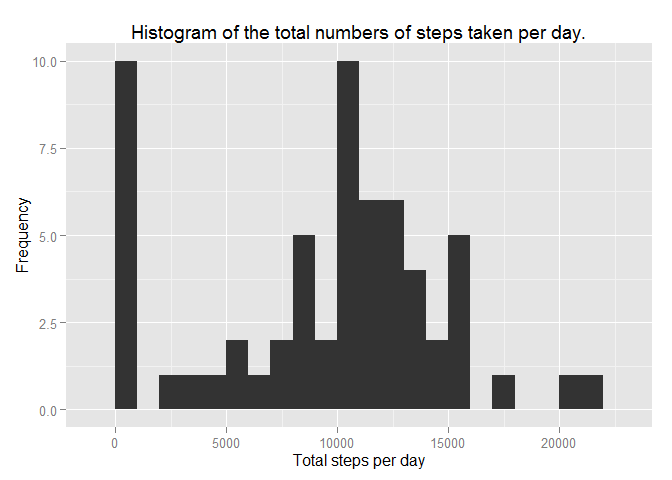
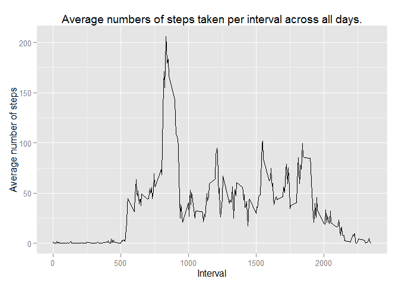
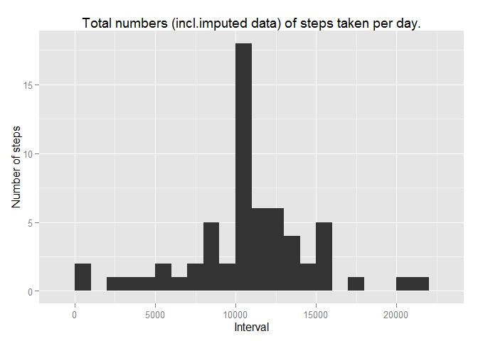
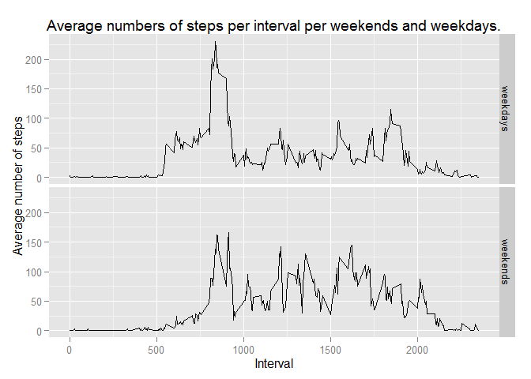

# Reproducible Research: Peer Assessment 1


## Loading and preprocessing the data


```r
library(ggplot2)      
library(dplyr)
```

```
## 
## Attaching package: 'dplyr'
## 
## The following objects are masked from 'package:stats':
## 
##     filter, lag
## 
## The following objects are masked from 'package:base':
## 
##     intersect, setdiff, setequal, union
```

```r
      ## Set data directory, source file name and destination file name      
            ddir  <- "./data"
            sfile <- "activity.zip"
            dfile <- "activity.csv"
      ## Create sub-directory for data if necessary
            if (!file.exists(ddir)) {dir.create(ddir)}

      ## Unzip data file if necessary
            if (!file.exists(paste(ddir, dfile, sep="/"))) {
                  unzip(sfile, exdir=ddir)
            }
      
            df <- tbl_df(read.csv(paste(ddir, dfile, sep="/"), 
                         header=TRUE, sep=",", stringsAsFactors=FALSE, na.strings="NA"))
            
            df$date <- as.Date(strptime(df$date, "%Y-%m-%d"))
```
  

## What is mean total number of steps taken per day?

```r
      ## Calculating summary 
            df_res <- df %>% group_by(date) %>% summarize(total_steps=sum(steps, na.rm=TRUE))
                  
      ## Plotting results
            g1 <- ggplot(df_res, aes(x=total_steps))+
                  geom_histogram(binwidth=1000) + 
                  labs(title="Histogram of the total numbers of steps taken per day.") +
                  labs(y="Frequency", x="Total steps per day")                  
            print(g1)
```

 

```r
            mean_of_total_steps   <- mean(df_res$total_steps, na.rm=TRUE)
            median_of_total_steps <- median(df_res$total_steps, na.rm=TRUE)
```
  
Mean of the total number of steps taken per day equals: **9354.23**  
Median of the total number of steps taken per day equals: **10395.00**  


## What is the average daily activity pattern?

```r
      ## Calculation of average number of steps per interval
            df_res <- df %>% group_by(interval) %>% summarize(avg_steps=mean(steps, na.rm=TRUE))
      
      ## Plotting results
            g2 <- ggplot(df_res, aes(x=interval, y=avg_steps))+
                  geom_line(stat="identity") + 
                  labs(title="Average numbers of steps taken per interval across all days.") +
                  labs(y="Average number of steps", x="Interval")
            print(g2)
```

 

```r
      ## Find interval with the maximum average number of steps            
            int_with_max_steps <- df_res[df_res$avg_steps==max(df_res$avg_steps),]
```
   
    
According to daily activity pattern maximum average number of steps=**206.17** occurs at interval **835**.  

## Imputing missing values   


```r
      ## Calculating number of missing values
            total_na <- sum(is.na(df$steps))
```
    
Total number of missing values equals: **2304**   
To avoid influence of missing values to analysis I replace them with **average number of steps in corresponding interval**. Following code makes these replacement and draw histogram on updated data.     
   


```r
      ## Imputed data
            df_imp <-   merge(df, df_res, by="interval") %>% 
                        mutate(steps_imp=ifelse(is.na(steps),avg_steps, steps))

      ## Calculating summary 
            df_res_imp <- df_imp %>% group_by(date) %>% summarize(total_steps=sum(steps_imp))
      
      ## Plotting results
            g3 <- ggplot(df_res_imp, aes(x=total_steps))+
                  geom_histogram(binwidth=1000) + 
                  labs(title="Total numbers (incl.imputed data) of steps taken per day.") +
                  labs(y="Number of steps", x="Interval")
            print(g3)
```

 

Recalculation of mean and median is made as well.   


```r
      ## Recalculating mean and median on dataframe with refilled NAs
            mean_of_total_steps_imp <- mean(df_res_imp$total_steps, na.rm=TRUE)
            median_of_total_steps_imp <- median(df_res_imp$total_steps, na.rm=TRUE)
```
   
Recalculated mean of the total number of steps taken per day is changed from **9354.23** to **10766.19**  
Recalculated median is changed from **10395.00** to **10766.19**  


## Are there differences in activity patterns between weekdays and weekends?

```r
      ## Add new variable days that takes "weekends" or "weekdays"     
            df_res <-   df_imp %>% 
                        mutate(days=ifelse(weekdays(date, abbreviate=TRUE)=="Сб" | 
                              weekdays(date, abbreviate=TRUE)=="Вс","weekends","weekdays")) %>%
                        group_by(interval, days) %>% 
                        summarize(avg_steps_imp=mean(steps_imp))

      ## Plotting results
            g4 <- ggplot(df_res, aes(x=interval, y=avg_steps_imp))+
                  geom_line(stat="identity") + 
                  facet_grid(days~.) +
                  labs(title="Average numbers of steps per interval per weekends and weekdays.") +
                  labs(y="Average number of steps", x="Interval")  
            print(g4)
```

 
